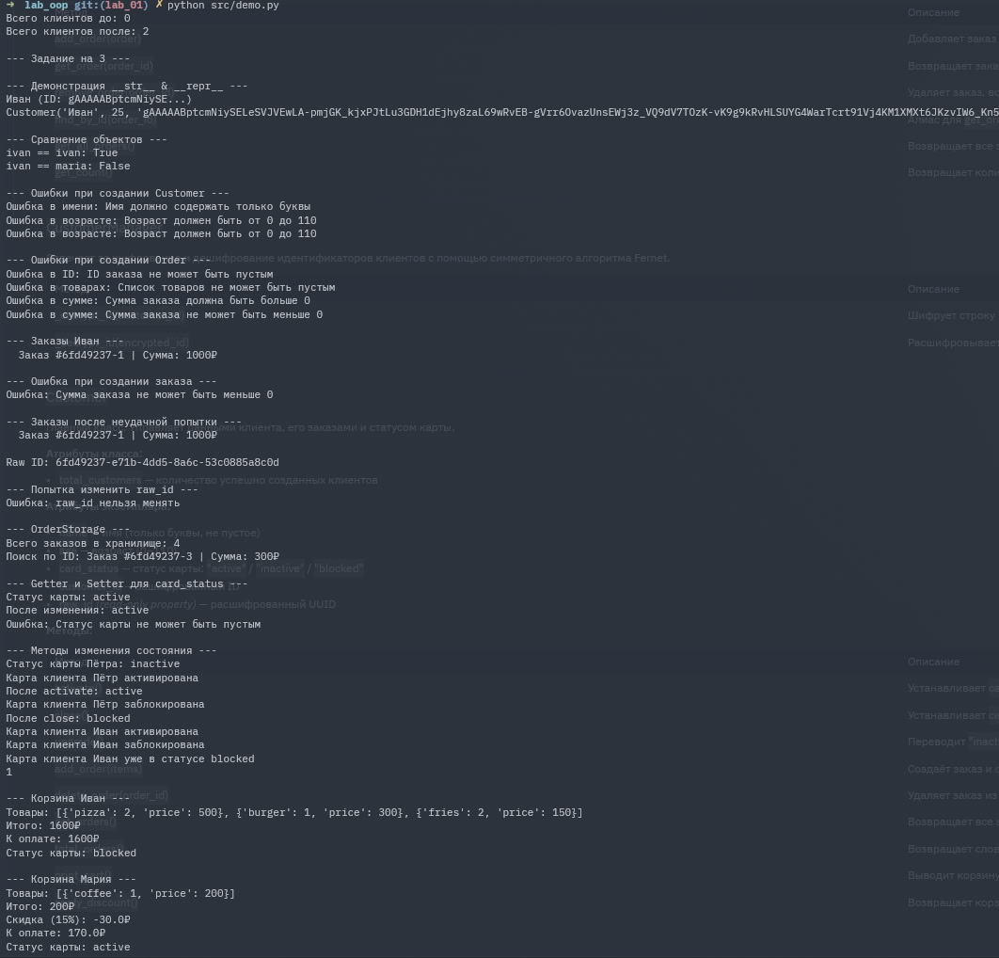

# Лабораторная работа №1: Объектно-ориентированное программирование

## Структура проекта

```
lab_oop/
├── src/
│   ├── model.py   — классы Validators, Order, OrderStorage, CustomerManager, Customer
│   └── demo.py    — демонстрация всей функциональности
├── images/
│   └── Screenshot_20260303_120042.png
└── README.md
```

---

## Соответствие критериям оценки

### Оценка 3

| Критерий | Реализация |
|----------|-----------|
| Класс с минимум 4 атрибутами | `Customer`: `name`, `age`, `card_status`, `customer_id`, `_raw_id` |
| Приватные поля | `_raw_id`, `_card_status` |
| Валидация в конструкторе | Проверка имени (только буквы), возраста (0–110), статуса карты |
| Свойство только для чтения | `raw_id` — property с запретом на запись через setter |
| Магические методы `__str__`, `__eq__` | Реализованы в `Customer` |
| Демонстрация создания, вывода, сравнения и ошибок | Покрыто в `demo.py` |

### Оценка 4

| Критерий | Реализация |
|----------|-----------|
| `__repr__` | Реализован в `Customer` |
| Setter с валидацией | `card_status` — property с проверкой на пустое значение |
| Атрибут класса | `total_customers` — счётчик созданных клиентов |
| Второй бизнес-метод | `print_cart()`, `apply_discount()`, `total_orders()` |
| Проверка типов и логических ограничений | `Validators.validate_range()`, `validate_positive()`, `validate_not_empty()` |

### Оценка 5

| Критерий | Реализация |
|----------|-----------|
| Валидация вынесена в отдельный класс | Класс `Validators` содержит все методы валидации (`validate_not_empty`, `validate_positive`, `validate_range`) |
| Методы изменения состояния | `activate()`, `close()`, `upgrade()` |
| Поведение, зависящее от состояния | Скидка 15% в `total_orders()` и `print_cart()` применяется только при `card_status == "active"` |

---

## Классы

### `Validators`

Статический класс с методами валидации. Используется всеми остальными классами.

| Метод | Описание |
|-------|----------|
| `validate_not_empty(value, field_name)` | Проверяет, что значение не `None`, не пустая строка и не пустой список |
| `validate_positive(value, field_name)` | Проверяет, что число не отрицательное |
| `validate_range(value, field_name, min_val, max_val)` | Проверяет, что число входит в диапазон `[min_val, max_val]` |

---

### `Order`

Представляет один заказ клиента.

**Атрибуты:**
- `order_id` — уникальный идентификатор заказа
- `items` — список товаров (`[{"название": количество, "price": цена}]`)
- `total` — итоговая сумма заказа
- `discount` — применённая скидка
- `original_total` — исходная сумма до скидки
- `created_at` — дата и время создания

**Валидация при создании:**
- `order_id` не может быть пустым
- `items` не может быть пустым списком
- `total` должен быть больше 0

---

### `OrderStorage`

Singleton-хранилище всех заказов.

| Метод | Описание |
|-------|----------|
| `add_order(order)` | Добавляет заказ в хранилище |
| `get_order(order_id)` | Возвращает заказ по ID |
| `remove_order(order_id)` | Удаляет заказ, возвращает `True`/`False` |
| `find_by_id(order_id)` | Алиас для `get_order` |
| `get_all_orders()` | Возвращает все заказы |
| `get_count()` | Возвращает количество заказов |

---

### `CustomerManager`

Отвечает за шифрование и дешифрование идентификаторов клиентов с помощью симметричного алгоритма Fernet.

| Метод | Описание |
|-------|----------|
| `_encrypt_id(customer_id)` | Шифрует строку ID |
| `_decrypt_id(encrypted_id)` | Расшифровывает зашифрованный ID |

---

### `Customer`

Главный класс. Управляет данными клиента, его заказами и статусом карты.

**Атрибуты класса:**
- `total_customers` — количество успешно созданных клиентов

**Атрибуты экземпляра:**
- `name` — имя (только буквы, не пустое)
- `age` — возраст (0–110)
- `card_status` — статус карты: `"active"` / `"inactive"` / `"blocked"`
- `customer_id` — зашифрованный ID
- `raw_id` *(read-only property)* — расшифрованный UUID

**Методы:**

| Метод | Описание |
|-------|----------|
| `activate()` | Устанавливает `card_status = "active"` |
| `close()` | Устанавливает `card_status = "blocked"` |
| `upgrade()` | Переводит `"inactive"` → `"active"`, иначе выводит сообщение |
| `add_order(items)` | Создаёт заказ и сохраняет в `OrderStorage` |
| `delete_order(order_id)` | Удаляет заказ из хранилища |
| `get_orders()` | Возвращает все заказы данного клиента |
| `total_orders()` | Возвращает словарь с заказами, суммой и скидкой (15% для `"active"`) |
| `print_cart()` | Выводит корзину в консоль |
| `apply_discount()` | Возвращает корзину с применённой скидкой |

---

## Пример использования


