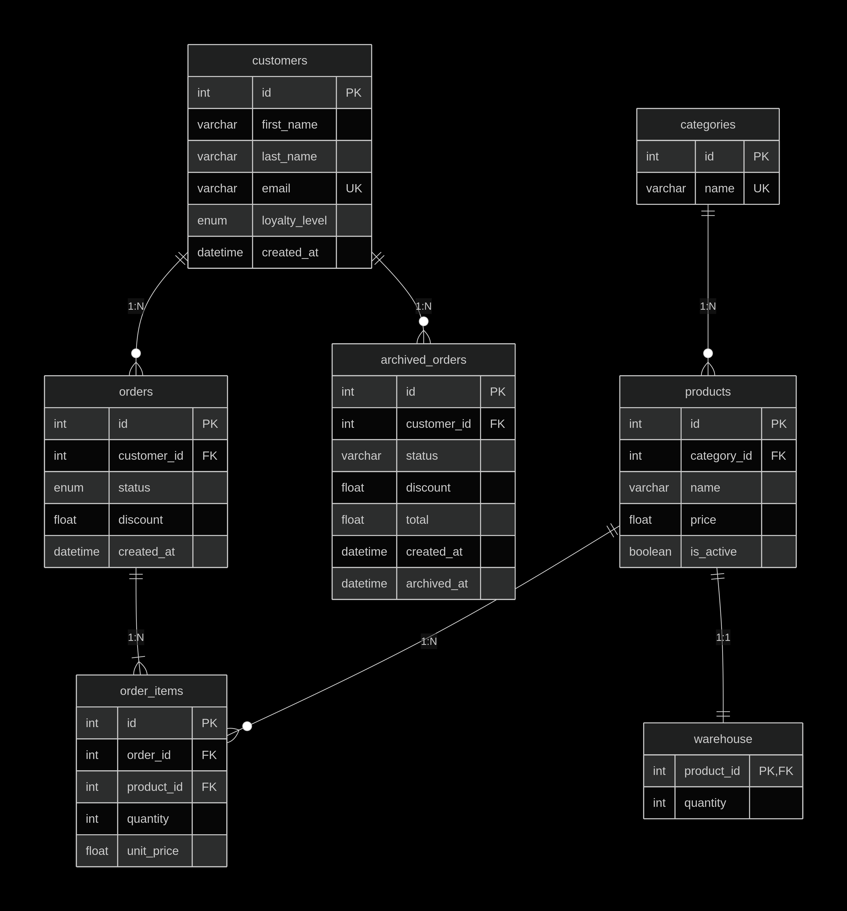
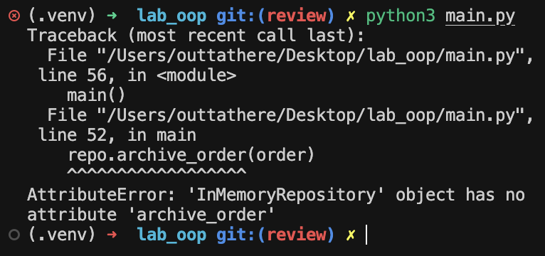

# Тут вероятно появятся комментарии

# Нарушение 3нФ?

> Обратите внимание что за значение хранится в total. 
> Согласно вашему CLI у вас total+discount выполняется каждый раз на ходу при выводе. 

> Но если хранить total в archived orders сразу со скидкой то наршуение 3нф, 
> тк появляяется транзитивная зависимость total -> id -> discount

> подумайте как хранить цену со скидкой без транзитивных зависимостей

# ноу коментс 

> абстрактный репозиторий и не такой уж абстракнтый да? 
> почему не в каждом абстрактном репозитории есть метод архиваци типа йоу 

# Недостаток функицонала в cli.py

> У вас нет возможности редачитьб поля кастомеров из меню cli 
> У вас нет возможности редачитьб поля заказов из меню cli  